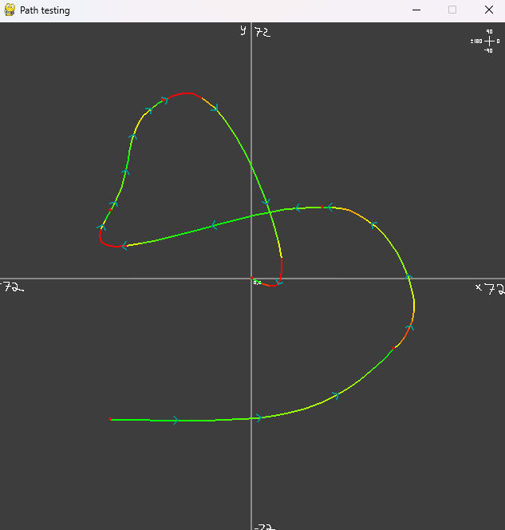

uhh wsg 

### What is this?
This is a path renderer. It uses quintic Hermite splines to create a smooth path for the robot to follow. It displays the curvature in the form of a gradient, indicating where the path should slow down or speed up.

### Example of the renderer:



### How to run the code:

1. **Install the dependencies:**

```bash
pip install -r requirements.txt
```

2. **Run the code:**

```bash
python main.py
```
